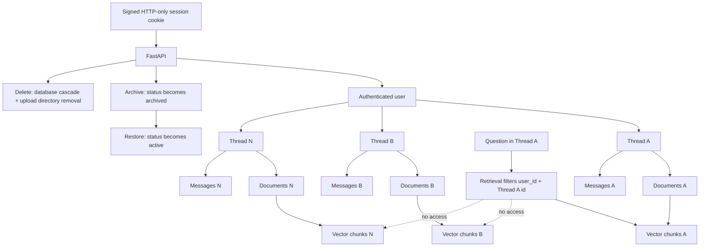

# Multi-Thread Architecture

Users can own multiple independent threads. The default thread list hides archived threads; `include_archived=true` includes them. Archiving preserves documents and messages. Permanent deletion does not create a searchable archive.

Isolation is enforced by FastAPI ownership dependencies and user/thread filters in database queries. The current application does not use Supabase Auth, PostgreSQL RLS, cross-thread retrieval, or archived-chat vectors.
