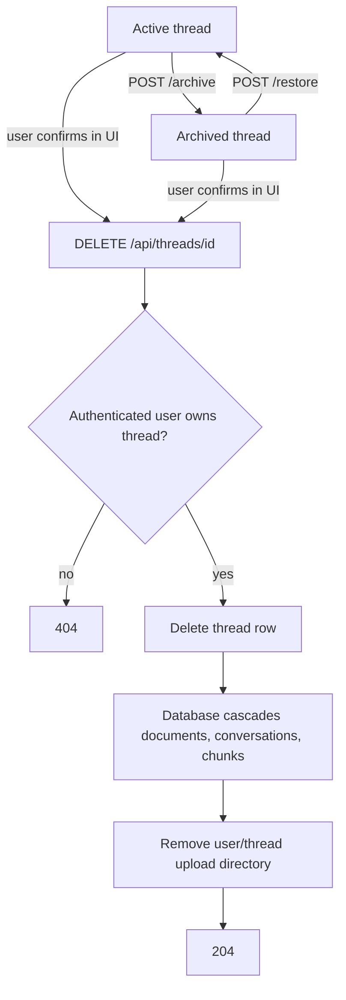

# Thread Lifecycle

Archiving is reversible and keeps all data. It only changes `threads.status`.

Permanent deletion is not an archival workflow. The API does not accept `confirmDeletion`, `archiveConversations`, or `preserveVectors`; confirmation is a browser concern. Deletion does not call a chat or embedding provider and does not create a searchable conversation archive.
