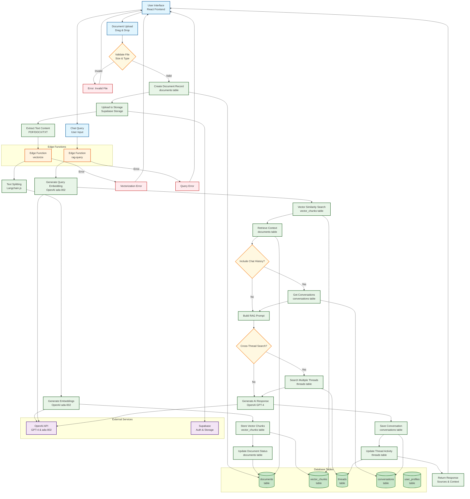

# Upload-to-Query Data Flow Diagram

This diagram shows the complete data flow from document upload through processing to RAG query execution, including all database table interactions and Edge Function calls.

## Process Details

### 1. Document Upload Flow
1. **File Validation**: Check file size (max 10MB) and type (PDF, DOCX, TXT, RTF)
2. **Database Record**: Create entry in `documents` table with status 'processing'
3. **Storage Upload**: Upload file to Supabase Storage with user-scoped path
4. **Text Extraction**: Extract text content from uploaded file
5. **Vectorization**: Process through Edge Function with Langchain.js
6. **Chunking**: Split text into 1000-token chunks with 200-token overlap
7. **Embedding**: Generate 1536-dimensional vectors using OpenAI ada-002
8. **Storage**: Store vectors in `vector_chunks` table with metadata
9. **Status Update**: Update document status to 'completed'

### 2. RAG Query Flow
1. **Query Input**: User submits question through chat interface
2. **Query Embedding**: Generate embedding for user query
3. **Vector Search**: Find similar chunks using cosine similarity
4. **Context Retrieval**: Get source documents and metadata
5. **Chat History**: Optionally include recent conversations
6. **Cross-Thread Search**: Optionally search across multiple threads
7. **Prompt Building**: Construct RAG prompt with context and history
8. **AI Generation**: Generate response using OpenAI GPT-4
9. **Response Storage**: Save conversation in `conversations` table
10. **Thread Update**: Update thread's last activity timestamp

### 3. Database Table Interactions

#### `documents` Table
- **Create**: New document record during upload
- **Update**: Status changes (processing → completed)
- **Read**: Retrieve document metadata for context

#### `vector_chunks` Table
- **Create**: Store document embeddings with metadata
- **Read**: Vector similarity search for RAG queries
- **Update**: Metadata updates (rare)

#### `threads` Table
- **Read**: Get user's threads for cross-thread search
- **Update**: Update last_activity_at timestamp

#### `conversations` Table
- **Create**: Save user queries and AI responses
- **Read**: Retrieve chat history for context

### 4. Edge Function Details

#### `vectorize` Function
- **Input**: Document ID, user ID, content, file metadata
- **Process**: Text splitting, embedding generation, batch storage
- **Output**: Vector count, processing status, error handling

#### `rag-query` Function
- **Input**: Thread ID, user ID, query, search options
- **Process**: Vector search, context building, AI generation
- **Output**: AI response, sources, performance metrics

### 5. Security & Scoping
- **User Isolation**: All operations scoped to authenticated user
- **RLS Policies**: Database access controlled by Row Level Security
- **File Validation**: Comprehensive file type and size validation
- **Error Handling**: Graceful error handling with user feedback

### 6. Performance Considerations
- **Batch Processing**: Vector storage in batches for efficiency
- **Caching**: Query results cached for repeated requests
- **Indexing**: Optimized vector indexes for similarity search
- **Rate Limiting**: API rate limits to prevent abuse 