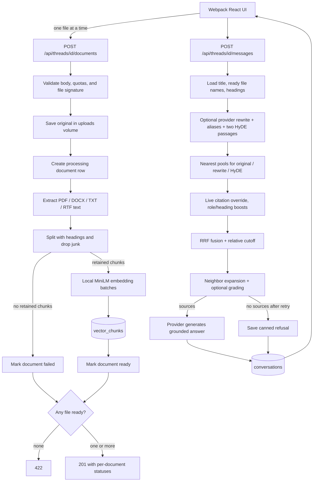

# Upload-to-Query Flow

```mermaid
flowchart TD
    UI[Webpack React UI] -->|one file at a time| POST[POST /api/threads/id/documents]
    POST --> VALIDATE[Validate body, quotas, and file signature]
    VALIDATE --> SAVE[Save original in uploads volume]
    SAVE --> DOC[Create processing document row]
    DOC --> EXTRACT[Extract PDF / DOCX / TXT / RTF text]
    EXTRACT --> CHUNK[Split with headings and drop junk]
    CHUNK -->|no retained chunks| FAILED[Mark document failed]
    CHUNK -->|retained chunks| EMBED[Local MiniLM embedding batches]
    EMBED --> VECTOR[(vector_chunks)]
    VECTOR --> READY[Mark document ready]
    FAILED --> STATUS{Any file ready?}
    READY --> STATUS
    STATUS -->|none| E422[422]
    STATUS -->|one or more| E201[201 with per-document statuses]

    UI --> QUESTION[POST /api/threads/id/messages]
    QUESTION --> CORPUS[Load title, ready file names, headings]
    CORPUS --> REWRITE[Optional provider rewrite + aliases + two HyDE passages]
    REWRITE --> SEARCH[Nearest pools for original / rewrite / HyDE]
    SEARCH --> FILTER[Live citation override, role/heading boosts]
    FILTER --> RRF[RRF fusion + relative cutoff]
    RRF --> GRADE[Neighbor expansion + optional grading]
    GRADE -->|sources| ANSWER[Provider generates grounded answer]
    GRADE -->|no sources after retry| REFUSE[Save canned refusal]
    ANSWER --> CONV[(conversations)]
    REFUSE --> CONV
    CONV --> UI
```

Embeddings are local by default. Query rewrite, optional grading, and answer generation use the selected OpenAI, xAI, or Anthropic chat provider. Retrieval always stays inside the selected thread.
